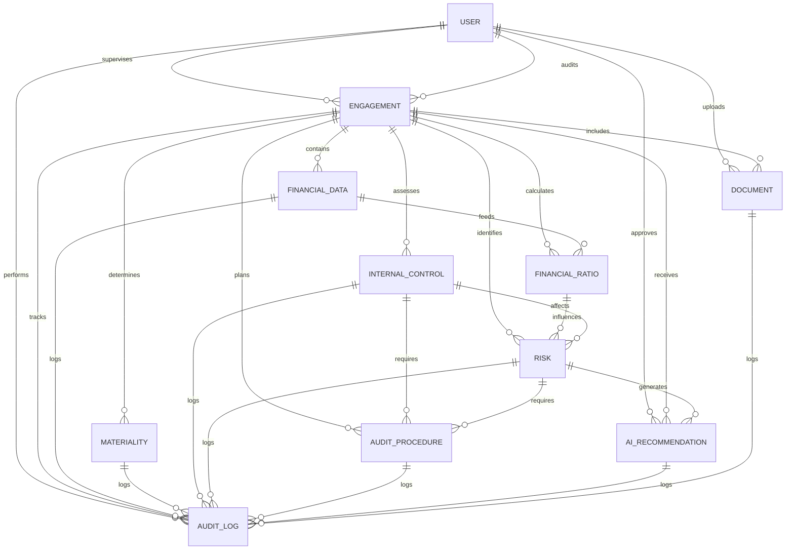

# IAPS Database Schema & Architecture

## Overview
This document defines the complete data model for the Intelligent Audit Planning and Risk Assessment System (IAPS). All entities follow audit standards (ISA, COSO) and implement comprehensive audit trails and compliance logging.

---

## Entity-Relationship Diagram (ER)



---

## Detailed Entity Specifications

### 1. USER
**Purpose:** Authentication, authorization, and role management  
**Audit Standard:** ISA 230 (Audit Documentation) - tracking auditor identities

```sql
CREATE TABLE auth_user (
    id BIGINT PRIMARY KEY AUTO_INCREMENT,
    
    -- Authentication
    email VARCHAR(255) UNIQUE NOT NULL,
    password_hash VARCHAR(255) NOT NULL,
    username VARCHAR(150) UNIQUE NOT NULL,
    
    -- Personal Information
    first_name VARCHAR(150) NOT NULL,
    last_name VARCHAR(150) NOT NULL,
    full_name VARCHAR(300) GENERATED ALWAYS AS (CONCAT(first_name, ' ', last_name)) STORED,
    
    -- Role-Based Access Control (RBAC)
    role VARCHAR(50) NOT NULL CHECK (role IN ('admin', 'supervisor', 'auditor', 'finance_manager')),
    
    -- 2FA & Security
    two_factor_enabled BOOLEAN DEFAULT FALSE,
    two_factor_secret VARCHAR(255) NULL,
    
    -- Status & Timestamps
    is_active BOOLEAN DEFAULT TRUE,
    last_login TIMESTAMP NULL,
    created_at TIMESTAMP DEFAULT CURRENT_TIMESTAMP,
    updated_at TIMESTAMP DEFAULT CURRENT_TIMESTAMP ON UPDATE CURRENT_TIMESTAMP,
    
    -- Keycloak Integration
    keycloak_id VARCHAR(255) UNIQUE NULL,
    
    -- Indexes
    INDEX idx_email (email),
    INDEX idx_role (role),
    INDEX idx_active (is_active),
    INDEX idx_created_at (created_at)
);
```

**Fields:**
| Field | Type | Constraint | Audit Purpose |
|-------|------|-----------|---|
| id | BIGINT | PK | Unique auditor identifier |
| email | VARCHAR(255) | UK, NOT NULL | Identity verification |
| password_hash | VARCHAR(255) | NOT NULL | Secure password storage |
| username | VARCHAR(150) | UK | Login identifier |
| first_name | VARCHAR(150) | NOT NULL | Audit documentation |
| last_name | VARCHAR(150) | NOT NULL | Audit documentation |
| role | VARCHAR(50) | CK, NOT NULL | Access control enforcement |
| two_factor_enabled | BOOLEAN | NOT NULL | Enhanced security |
| is_active | BOOLEAN | NOT NULL | User status tracking |
| last_login | TIMESTAMP | NULL | Activity tracking |
| created_at | TIMESTAMP | NOT NULL | Audit trail |
| updated_at | TIMESTAMP | NOT NULL | Change tracking |
| keycloak_id | VARCHAR(255) | UK | SSO integration |

---

### 2. ENGAGEMENT
**Purpose:** Central entity representing an audit engagement  
**Audit Standard:** ISA 210 (Agreement on Audit Terms)

```sql
CREATE TABLE engagements_engagement (
    id BIGINT PRIMARY KEY AUTO_INCREMENT,
    
    -- Basic Information
    name VARCHAR(255) NOT NULL,
    description TEXT,
    client_organization VARCHAR(255) NOT NULL,
    
    -- Engagement Period
    start_date DATE NOT NULL,
    end_date DATE NOT NULL,
    CHECK (end_date >= start_date),
    
    -- Scope & Objectives
    scope TEXT NOT NULL,
    objectives TEXT NOT NULL,
    audit_approach VARCHAR(255),
    
    -- Personnel Assignment
    supervisor_id BIGINT NOT NULL FOREIGN KEY REFERENCES auth_user(id),
    primary_auditor_id BIGINT NOT NULL FOREIGN KEY REFERENCES auth_user(id),
    
    -- Status Tracking
    status VARCHAR(50) NOT NULL DEFAULT 'planning' CHECK (status IN ('planning', 'in_progress', 'completed', 'on_hold')),
    progress_percentage INT DEFAULT 0 CHECK (progress_percentage BETWEEN 0 AND 100),
    
    -- Financial Entities
    financial_entities TEXT, -- JSON array of entity codes/names
    
    -- Materiality Settings Reference
    materiality_id BIGINT NULL FOREIGN KEY REFERENCES engagements_materiality(id),
    
    -- Timestamps & Audit Trail
    created_by_id BIGINT NOT NULL FOREIGN KEY REFERENCES auth_user(id),
    created_at TIMESTAMP DEFAULT CURRENT_TIMESTAMP,
    updated_at TIMESTAMP DEFAULT CURRENT_TIMESTAMP ON UPDATE CURRENT_TIMESTAMP,
    
    -- Indexes
    INDEX idx_status (status),
    INDEX idx_supervisor (supervisor_id),
    INDEX idx_start_date (start_date),
    INDEX idx_created_at (created_at),
    CONSTRAINT fk_supervisor FOREIGN KEY (supervisor_id) REFERENCES auth_user(id),
    CONSTRAINT fk_primary_auditor FOREIGN KEY (primary_auditor_id) REFERENCES auth_user(id),
    CONSTRAINT fk_created_by FOREIGN KEY (created_by_id) REFERENCES auth_user(id)
);
```

**Fields:**
| Field | Type | Constraint | Audit Purpose |
|-------|------|-----------|---|
| id | BIGINT | PK | Engagement identifier |
| name | VARCHAR(255) | NOT NULL | Engagement identification |
| client_organization | VARCHAR(255) | NOT NULL | Client tracking |
| start_date | DATE | NOT NULL, CK | Audit period definition |
| end_date | DATE | NOT NULL, CK | Audit period definition |
| scope | TEXT | NOT NULL | Audit scope documentation |
| objectives | TEXT | NOT NULL | Audit objectives |
| supervisor_id | BIGINT | FK, NOT NULL | Supervisor assignment |
| primary_auditor_id | BIGINT | FK, NOT NULL | Auditor assignment |
| status | VARCHAR(50) | CK, NOT NULL | Engagement status |
| materiality_id | BIGINT | FK | Link to materiality calc |
| created_by_id | BIGINT | FK, NOT NULL | Audit trail |
| created_at | TIMESTAMP | NOT NULL | Audit trail |
| updated_at | TIMESTAMP | NOT NULL | Change tracking |

---

### 3. FINANCIAL_DATA
**Purpose:** Store uploaded financial statements and transaction data  
**Audit Standard:** ISA 500 (Audit Evidence)

```sql
CREATE TABLE financial_financial_data (
    id BIGINT PRIMARY KEY AUTO_INCREMENT,
    
    -- Engagement Link
    engagement_id BIGINT NOT NULL FOREIGN KEY REFERENCES engagements_engagement(id) ON DELETE CASCADE,
    
    -- Data Identification
    data_period_start DATE NOT NULL,
    data_period_end DATE NOT NULL,
    period_type VARCHAR(50) NOT NULL CHECK (period_type IN ('annual', 'quarterly', 'monthly')),
    
    -- Account Information
    account_code VARCHAR(50) NOT NULL,
    account_name VARCHAR(255) NOT NULL,
    account_type VARCHAR(50) NOT NULL CHECK (account_type IN ('asset', 'liability', 'equity', 'revenue', 'expense')),
    
    -- Financial Amount
    amount DECIMAL(19, 2) NOT NULL,
    currency VARCHAR(3) DEFAULT 'USD',
    
    -- Data Quality
    validation_status VARCHAR(50) DEFAULT 'pending' CHECK (validation_status IN ('pending', 'validated', 'error', 'corrected')),
    validation_errors TEXT NULL,
    
    -- Source & Audit Trail
    source VARCHAR(100) NOT NULL CHECK (source IN ('manual_upload', 'system_integration', 'manual_entry')),
    uploaded_by_id BIGINT NOT NULL FOREIGN KEY REFERENCES auth_user(id),
    uploaded_at TIMESTAMP DEFAULT CURRENT_TIMESTAMP,
    
    -- Version Control
    version INT DEFAULT 1,
    prior_version_id BIGINT NULL FOREIGN KEY REFERENCES financial_financial_data(id),
    
    -- Indexes
    INDEX idx_engagement_period (engagement_id, data_period_start),
    INDEX idx_account_code (account_code),
    INDEX idx_validation_status (validation_status),
    CONSTRAINT fk_engagement FOREIGN KEY (engagement_id) REFERENCES engagements_engagement(id),
    CONSTRAINT fk_uploaded_by FOREIGN KEY (uploaded_by_id) REFERENCES auth_user(id),
    CONSTRAINT fk_prior_version FOREIGN KEY (prior_version_id) REFERENCES financial_financial_data(id)
);
```

**Fields:**
| Field | Type | Constraint | Audit Purpose |
|-------|------|-----------|---|
| id | BIGINT | PK | Data record identifier |
| engagement_id | BIGINT | FK, NOT NULL | Link to engagement |
| data_period_start | DATE | NOT NULL | Audit period |
| data_period_end | DATE | NOT NULL | Audit period |
| account_code | VARCHAR(50) | NOT NULL | Chart of accounts ref |
| amount | DECIMAL(19,2) | NOT NULL | Financial amount |
| validation_status | VARCHAR(50) | CK | Data quality control |
| source | VARCHAR(100) | CK, NOT NULL | Evidence source |
| uploaded_by_id | BIGINT | FK, NOT NULL | Audit trail |
| uploaded_at | TIMESTAMP | NOT NULL | Evidence timestamp |
| version | INT | NOT NULL | Version control |

---

### 4. FINANCIAL_RATIO
**Purpose:** Store calculated financial ratios for trend analysis  
**Audit Standard:** ISA 520 (Analytical Procedures)

```sql
CREATE TABLE financial_financial_ratio (
    id BIGINT PRIMARY KEY AUTO_INCREMENT,
    
    -- Engagement Link
    engagement_id BIGINT NOT NULL FOREIGN KEY REFERENCES engagements_engagement(id) ON DELETE CASCADE,
    
    -- Period Information
    calculation_period_start DATE NOT NULL,
    calculation_period_end DATE NOT NULL,
    calculation_date TIMESTAMP DEFAULT CURRENT_TIMESTAMP,
    
    -- Ratio Classification
    ratio_category VARCHAR(50) NOT NULL CHECK (ratio_category IN ('liquidity', 'profitability', 'efficiency', 'leverage')),
    ratio_name VARCHAR(100) NOT NULL,
    ratio_formula VARCHAR(255) NOT NULL,
    
    -- Ratio Values
    current_value DECIMAL(19, 4),
    prior_period_value DECIMAL(19, 4) NULL,
    benchmark_value DECIMAL(19, 4) NULL,
    
    -- Analysis Results
    variance_percentage DECIMAL(10, 2) NULL,
    variance_status VARCHAR(50) CHECK (variance_status IN ('normal', 'warning', 'alert')),
    trend_analysis VARCHAR(255),
    
    -- Calculated By
    calculated_by_id BIGINT NOT NULL FOREIGN KEY REFERENCES auth_user(id),
    
    -- Indexes
    INDEX idx_engagement_category (engagement_id, ratio_category),
    INDEX idx_calculation_date (calculation_date),
    INDEX idx_variance_status (variance_status),
    CONSTRAINT fk_engagement FOREIGN KEY (engagement_id) REFERENCES engagements_engagement(id),
    CONSTRAINT fk_calculated_by FOREIGN KEY (calculated_by_id) REFERENCES auth_user(id)
);
```

**Fields:**
| Field | Type | Constraint | Audit Purpose |
|-------|------|-----------|---|
| id | BIGINT | PK | Ratio calculation ID |
| engagement_id | BIGINT | FK, NOT NULL | Link to engagement |
| ratio_category | VARCHAR(50) | CK, NOT NULL | Ratio classification |
| ratio_name | VARCHAR(100) | NOT NULL | Ratio description |
| current_value | DECIMAL(19,4) | NULL | Current calculation |
| prior_period_value | DECIMAL(19,4) | NULL | Comparison value |
| benchmark_value | DECIMAL(19,4) | NULL | Industry benchmark |
| variance_percentage | DECIMAL(10,2) | NULL | Variance calculation |
| variance_status | VARCHAR(50) | CK | Risk indicator |
| calculated_by_id | BIGINT | FK, NOT NULL | Audit trail |
| calculation_date | TIMESTAMP | NOT NULL | Audit trail |

---

### 5. MATERIALITY
**Purpose:** Store materiality determinations and calculations  
**Audit Standard:** ISA 320 (Materiality in Planning and Performing an Audit)

```sql
CREATE TABLE engagements_materiality (
    id BIGINT PRIMARY KEY AUTO_INCREMENT,
    
    -- Engagement Link
    engagement_id BIGINT NOT NULL FOREIGN KEY REFERENCES engagements_engagement(id) ON DELETE CASCADE,
    
    -- Quantitative Materiality
    overall_materiality DECIMAL(19, 2) NOT NULL,
    overall_materiality_percentage DECIMAL(10, 4) NOT NULL,
    materiality_benchmark VARCHAR(100) NOT NULL CHECK (materiality_benchmark IN ('revenue', 'net_income', 'total_equity', 'total_assets')),
    benchmark_amount DECIMAL(19, 2) NOT NULL,
    
    -- Performance Materiality
    performance_materiality DECIMAL(19, 2) NOT NULL,
    performance_materiality_percentage DECIMAL(10, 4) NOT NULL,
    
    -- Clearly Trivial Threshold
    clearly_trivial_threshold DECIMAL(19, 2) NOT NULL,
    clearly_trivial_percentage DECIMAL(10, 4) NOT NULL,
    
    -- Qualitative Materiality Assessment
    qualitative_factors TEXT NOT NULL,
    sensitive_accounts TEXT,
    regulatory_requirements TEXT,
    known_problem_areas TEXT,
    
    -- Approval & Sign-off
    prepared_by_id BIGINT NOT NULL FOREIGN KEY REFERENCES auth_user(id),
    approved_by_id BIGINT NULL FOREIGN KEY REFERENCES auth_user(id),
    approved_at TIMESTAMP NULL,
    approval_comments TEXT,
    
    -- Justification & Documentation
    calculation_methodology TEXT NOT NULL,
    basis_of_determination TEXT NOT NULL,
    
    -- Audit Trail
    created_at TIMESTAMP DEFAULT CURRENT_TIMESTAMP,
    updated_at TIMESTAMP DEFAULT CURRENT_TIMESTAMP ON UPDATE CURRENT_TIMESTAMP,
    
    -- Indexes
    INDEX idx_engagement (engagement_id),
    INDEX idx_approved_at (approved_at),
    CONSTRAINT fk_engagement FOREIGN KEY (engagement_id) REFERENCES engagements_engagement(id),
    CONSTRAINT fk_prepared_by FOREIGN KEY (prepared_by_id) REFERENCES auth_user(id),
    CONSTRAINT fk_approved_by FOREIGN KEY (approved_by_id) REFERENCES auth_user(id)
);
```

**Fields:**
| Field | Type | Constraint | Audit Purpose |
|-------|------|-----------|---|
| id | BIGINT | PK | Materiality ID |
| engagement_id | BIGINT | FK, NOT NULL | Link to engagement |
| overall_materiality | DECIMAL(19,2) | NOT NULL | Quantitative threshold |
| materiality_benchmark | VARCHAR(100) | CK, NOT NULL | Benchmark selection |
| performance_materiality | DECIMAL(19,2) | NOT NULL | Reduced threshold |
| clearly_trivial_threshold | DECIMAL(19,2) | NOT NULL | Posting threshold |
| qualitative_factors | TEXT | NOT NULL | ISA 320 compliance |
| prepared_by_id | BIGINT | FK, NOT NULL | Audit trail |
| approved_by_id | BIGINT | FK | Supervisor approval |
| approved_at | TIMESTAMP | NULL | Sign-off date |
| calculation_methodology | TEXT | NOT NULL | Documentation |
| basis_of_determination | TEXT | NOT NULL | Justification |
| created_at | TIMESTAMP | NOT NULL | Audit trail |
| updated_at | TIMESTAMP | NOT NULL | Change tracking |

---

### 6. INTERNAL_CONTROL
**Purpose:** Document internal controls and their effectiveness  
**Audit Standard:** ISA 330 (The Auditor's Responses to Assessed Risks), COSO Framework

```sql
CREATE TABLE risk_internal_control (
    id BIGINT PRIMARY KEY AUTO_INCREMENT,
    
    -- Engagement & Control Identification
    engagement_id BIGINT NOT NULL FOREIGN KEY REFERENCES engagements_engagement(id) ON DELETE CASCADE,
    control_id VARCHAR(50) NOT NULL,
    control_name VARCHAR(255) NOT NULL,
    
    -- Control Description
    control_description TEXT NOT NULL,
    control_objective TEXT NOT NULL,
    control_type VARCHAR(50) NOT NULL CHECK (control_type IN ('preventive', 'detective', 'corrective')),
    coso_component VARCHAR(100) NOT NULL CHECK (coso_component IN ('control_environment', 'risk_assessment', 'control_activities', 'information_communication', 'monitoring')),
    
    -- Risk Assessment
    inherent_risk VARCHAR(50) NOT NULL CHECK (inherent_risk IN ('high', 'medium', 'low')),
    inherent_risk_score INT CHECK (inherent_risk_score BETWEEN 1 AND 5),
    control_risk VARCHAR(50) NOT NULL CHECK (control_risk IN ('high', 'medium', 'low')),
    control_risk_score INT CHECK (control_risk_score BETWEEN 1 AND 5),
    
    -- ROMM Calculation
    risk_of_material_misstatement DECIMAL(10, 4) GENERATED ALWAYS AS (inherent_risk_score * control_risk_score / 25) STORED,
    
    -- Control Effectiveness
    effectiveness_rating VARCHAR(50) NOT NULL CHECK (effectiveness_rating IN ('effective', 'partially_effective', 'ineffective')),
    effectiveness_evidence TEXT,
    
    -- Control Testing Approach
    testing_approach VARCHAR(100) NOT NULL CHECK (testing_approach IN ('observation', 'inquiry', 'inspection', 'reperformance', 'analytical')),
    sample_size INT,
    sampling_method VARCHAR(100),
    
    -- Control Owner & Assessment
    control_owner_id BIGINT NOT NULL FOREIGN KEY REFERENCES auth_user(id),
    assessed_by_id BIGINT NOT NULL FOREIGN KEY REFERENCES auth_user(id),
    assessment_date DATE NOT NULL,
    
    -- Audit Trail
    created_at TIMESTAMP DEFAULT CURRENT_TIMESTAMP,
    updated_at TIMESTAMP DEFAULT CURRENT_TIMESTAMP ON UPDATE CURRENT_TIMESTAMP,
    
    -- Indexes
    INDEX idx_engagement_control (engagement_id, control_id),
    INDEX idx_effectiveness (effectiveness_rating),
    INDEX idx_assessment_date (assessment_date),
    CONSTRAINT fk_engagement FOREIGN KEY (engagement_id) REFERENCES engagements_engagement(id),
    CONSTRAINT fk_control_owner FOREIGN KEY (control_owner_id) REFERENCES auth_user(id),
    CONSTRAINT fk_assessed_by FOREIGN KEY (assessed_by_id) REFERENCES auth_user(id)
);
```

**Fields:**
| Field | Type | Constraint | Audit Purpose |
|-------|------|-----------|---|
| id | BIGINT | PK | Control record ID |
| engagement_id | BIGINT | FK, NOT NULL | Link to engagement |
| control_id | VARCHAR(50) | NOT NULL | Control reference |
| control_description | TEXT | NOT NULL | Control documentation |
| control_objective | TEXT | NOT NULL | Control purpose (ISA 330) |
| inherent_risk_score | INT | CK | Risk assessment |
| control_risk_score | INT | CK | Control effectiveness |
| risk_of_material_misstatement | DECIMAL(10,4) | GENERATED | ROMM calculation |
| effectiveness_rating | VARCHAR(50) | CK, NOT NULL | Control evaluation |
| effectiveness_evidence | TEXT | NULL | Test results |
| testing_approach | VARCHAR(100) | CK, NOT NULL | Testing method |
| sample_size | INT | NULL | Sample documentation |
| assessed_by_id | BIGINT | FK, NOT NULL | Audit trail |
| assessment_date | DATE | NOT NULL | Assessment date |

---

### 7. RISK
**Purpose:** Identify and score audit risks  
**Audit Standard:** ISA 315 (Risk Assessment), ISA 330 (Response to Risks)

```sql
CREATE TABLE risk_risk (
    id BIGINT PRIMARY KEY AUTO_INCREMENT,
    
    -- Engagement & Risk Identification
    engagement_id BIGINT NOT NULL FOREIGN KEY REFERENCES engagements_engagement(id) ON DELETE CASCADE,
    risk_id VARCHAR(50) NOT NULL,
    risk_description TEXT NOT NULL,
    
    -- Risk Classification
    risk_category VARCHAR(100) NOT NULL CHECK (risk_category IN ('financial_reporting', 'internal_controls', 'fraud', 'compliance', 'operational', 'strategic')),
    risk_type VARCHAR(50) NOT NULL CHECK (risk_type IN ('inherent', 'control', 'detection')),
    
    -- Risk Assessment Matrix
    likelihood VARCHAR(50) NOT NULL CHECK (likelihood IN ('remote', 'unlikely', 'possible', 'likely', 'probable')),
    likelihood_score INT CHECK (likelihood_score BETWEEN 1 AND 5),
    
    impact VARCHAR(50) NOT NULL CHECK (impact IN ('minimal', 'minor', 'moderate', 'major', 'critical')),
    impact_score INT CHECK (impact_score BETWEEN 1 AND 5),
    
    -- Overall Risk Score
    overall_risk_score INT GENERATED ALWAYS AS (likelihood_score * impact_score) STORED,
    risk_level VARCHAR(50) GENERATED ALWAYS AS (
        CASE 
            WHEN (likelihood_score * impact_score) >= 20 THEN 'critical'
            WHEN (likelihood_score * impact_score) >= 12 THEN 'high'
            WHEN (likelihood_score * impact_score) >= 6 THEN 'medium'
            ELSE 'low'
        END
    ) STORED,
    
    -- Risk Justification
    basis_for_risk_assessment TEXT NOT NULL,
    potential_impact_description TEXT,
    
    -- Risk Mitigation
    mitigation_strategy TEXT,
    mitigating_controls TEXT,
    
    -- Risk Ownership & Status
    risk_owner_id BIGINT NOT NULL FOREIGN KEY REFERENCES auth_user(id),
    status VARCHAR(50) NOT NULL DEFAULT 'identified' CHECK (status IN ('identified', 'mitigated', 'accepted', 'rejected', 'monitoring')),
    
    -- Related Entities
    related_financial_ratios TEXT, -- JSON array of ratio IDs
    related_controls_ids TEXT, -- JSON array of control IDs
    
    -- Audit Trail
    identified_by_id BIGINT NOT NULL FOREIGN KEY REFERENCES auth_user(id),
    identified_at TIMESTAMP DEFAULT CURRENT_TIMESTAMP,
    updated_at TIMESTAMP DEFAULT CURRENT_TIMESTAMP ON UPDATE CURRENT_TIMESTAMP,
    
    -- Indexes
    INDEX idx_engagement_risk (engagement_id, risk_id),
    INDEX idx_risk_level (risk_level),
    INDEX idx_status (status),
    INDEX idx_identified_at (identified_at),
    CONSTRAINT fk_engagement FOREIGN KEY (engagement_id) REFERENCES engagements_engagement(id),
    CONSTRAINT fk_risk_owner FOREIGN KEY (risk_owner_id) REFERENCES auth_user(id),
    CONSTRAINT fk_identified_by FOREIGN KEY (identified_by_id) REFERENCES auth_user(id)
);
```

**Fields:**
| Field | Type | Constraint | Audit Purpose |
|-------|------|-----------|---|
| id | BIGINT | PK | Risk record ID |
| engagement_id | BIGINT | FK, NOT NULL | Link to engagement |
| risk_id | VARCHAR(50) | NOT NULL | Risk reference |
| risk_description | TEXT | NOT NULL | Risk documentation |
| risk_category | VARCHAR(100) | CK, NOT NULL | Risk classification |
| likelihood_score | INT | CK | Probability assessment |
| impact_score | INT | CK | Consequence assessment |
| overall_risk_score | INT | GENERATED | Risk magnitude |
| risk_level | VARCHAR(50) | GENERATED | Priority ranking |
| basis_for_risk_assessment | TEXT | NOT NULL | ISA 315 compliance |
| mitigation_strategy | TEXT | NULL | Risk response |
| risk_owner_id | BIGINT | FK, NOT NULL | Accountability |
| status | VARCHAR(50) | CK, NOT NULL | Risk status |
| identified_by_id | BIGINT | FK, NOT NULL | Audit trail |
| identified_at | TIMESTAMP | NOT NULL | Date of identification |

---

### 8. AUDIT_PROCEDURE
**Purpose:** Define and track audit procedures planned in response to identified risks  
**Audit Standard:** ISA 330 (The Auditor's Procedures in Response to Assessed Risks)

```sql
CREATE TABLE planning_audit_procedure (
    id BIGINT PRIMARY KEY AUTO_INCREMENT,
    
    -- Engagement & Procedure Identification
    engagement_id BIGINT NOT NULL FOREIGN KEY REFERENCES engagements_engagement(id) ON DELETE CASCADE,
    procedure_id VARCHAR(50) NOT NULL,
    risk_id BIGINT NOT NULL FOREIGN KEY REFERENCES risk_risk(id),
    
    -- Procedure Description
    procedure_description TEXT NOT NULL,
    procedure_objective TEXT NOT NULL,
    
    -- Procedure Classification
    procedure_type VARCHAR(50) NOT NULL CHECK (procedure_type IN ('analytical', 'substantive', 'test_of_control')),
    audit_area VARCHAR(100),
    
    -- Sampling Parameters
    sample_size INT,
    sampling_method VARCHAR(100) CHECK (sampling_method IN ('random', 'systematic', 'stratified', 'judgmental', 'haphazard')),
    sample_justification TEXT,
    
    -- Procedure Execution Details
    responsible_auditor_id BIGINT NOT NULL FOREIGN KEY REFERENCES auth_user(id),
    expected_evidence TEXT,
    evidence_threshold TEXT,
    materiality_consideration DECIMAL(19, 2) NULL,
    
    -- Procedure Status
    status VARCHAR(50) NOT NULL DEFAULT 'planned' CHECK (status IN ('planned', 'in_progress', 'completed', 'blocked')),
    
    -- Source Tracking
    generated_by VARCHAR(50) NOT NULL CHECK (generated_by IN ('ai', 'manual', 'template')),
    ai_recommendation_id BIGINT NULL FOREIGN KEY REFERENCES planning_ai_recommendation(id),
    
    -- Audit Trail
    created_by_id BIGINT NOT NULL FOREIGN KEY REFERENCES auth_user(id),
    created_at TIMESTAMP DEFAULT CURRENT_TIMESTAMP,
    updated_at TIMESTAMP DEFAULT CURRENT_TIMESTAMP ON UPDATE CURRENT_TIMESTAMP,
    
    -- Indexes
    INDEX idx_engagement_procedure (engagement_id, procedure_id),
    INDEX idx_risk_id (risk_id),
    INDEX idx_status (status),
    CONSTRAINT fk_engagement FOREIGN KEY (engagement_id) REFERENCES engagements_engagement(id),
    CONSTRAINT fk_risk FOREIGN KEY (risk_id) REFERENCES risk_risk(id),
    CONSTRAINT fk_responsible_auditor FOREIGN KEY (responsible_auditor_id) REFERENCES auth_user(id),
    CONSTRAINT fk_created_by FOREIGN KEY (created_by_id) REFERENCES auth_user(id),
    CONSTRAINT fk_ai_recommendation FOREIGN KEY (ai_recommendation_id) REFERENCES planning_ai_recommendation(id)
);
```

**Fields:**
| Field | Type | Constraint | Audit Purpose |
|-------|------|-----------|---|
| id | BIGINT | PK | Procedure record ID |
| engagement_id | BIGINT | FK, NOT NULL | Link to engagement |
| risk_id | BIGINT | FK, NOT NULL | Link to identified risk |
| procedure_description | TEXT | NOT NULL | Procedure documentation |
| procedure_type | VARCHAR(50) | CK, NOT NULL | Type of audit test |
| sample_size | INT | NULL | Sample documentation |
| sampling_method | VARCHAR(100) | CK | Sampling approach |
| responsible_auditor_id | BIGINT | FK, NOT NULL | Resource allocation |
| expected_evidence | TEXT | NULL | Evidence specification |
| status | VARCHAR(50) | CK, NOT NULL | Progress tracking |
| generated_by | VARCHAR(50) | CK, NOT NULL | Source (AI vs manual) |
| ai_recommendation_id | BIGINT | FK | Link to AI suggestion |
| created_by_id | BIGINT | FK, NOT NULL | Audit trail |
| created_at | TIMESTAMP | NOT NULL | Audit trail |

---

### 9. AI_RECOMMENDATION
**Purpose:** Store AI-generated recommendations and audit supervisor approvals  
**Audit Standard:** ISA 230 (Audit Documentation), ISA 330 (Auditor Response to Risks)

```sql
CREATE TABLE planning_ai_recommendation (
    id BIGINT PRIMARY KEY AUTO_INCREMENT,
    
    -- Engagement & Recommendation
    engagement_id BIGINT NOT NULL FOREIGN KEY REFERENCES engagements_engagement(id) ON DELETE CASCADE,
    recommendation_category VARCHAR(100) NOT NULL CHECK (recommendation_category IN ('risk_procedure', 'sampling_approach', 'materiality', 'resource_allocation', 'control_testing')),
    
    -- AI Generation Details
    ai_model VARCHAR(100) NOT NULL DEFAULT 'claude-3-5-sonnet',
    ai_prompt TEXT NOT NULL,
    ai_response TEXT NOT NULL,
    ai_generation_timestamp TIMESTAMP NOT NULL,
    
    -- Recommendation Content
    recommendation_title VARCHAR(255) NOT NULL,
    recommendation_description TEXT NOT NULL,
    reasoning_and_justification TEXT NOT NULL,
    
    -- Confidence & Parameters
    confidence_score INT CHECK (confidence_score BETWEEN 1 AND 100),
    estimated_effort_hours INT,
    
    -- Supervisor Review & Approval
    reviewer_id BIGINT NOT NULL FOREIGN KEY REFERENCES auth_user(id),
    review_status VARCHAR(50) NOT NULL DEFAULT 'pending' CHECK (review_status IN ('pending', 'approved', 'modified', 'rejected')),
    reviewer_comments TEXT,
    review_timestamp TIMESTAMP NULL,
    
    -- Modifications Tracking
    original_recommendation TEXT,
    modifications_made TEXT,
    modified_by_id BIGINT NULL FOREIGN KEY REFERENCES auth_user(id),
    modified_at TIMESTAMP NULL,
    
    -- Related Procedures & Risks
    related_risks_ids TEXT, -- JSON array
    generated_procedures_ids TEXT, -- JSON array
    
    -- Audit Trail
    created_at TIMESTAMP DEFAULT CURRENT_TIMESTAMP,
    updated_at TIMESTAMP DEFAULT CURRENT_TIMESTAMP ON UPDATE CURRENT_TIMESTAMP,
    
    -- Indexes
    INDEX idx_engagement_review (engagement_id, review_status),
    INDEX idx_ai_generation (ai_generation_timestamp),
    INDEX idx_review_status (review_status),
    CONSTRAINT fk_engagement FOREIGN KEY (engagement_id) REFERENCES engagements_engagement(id),
    CONSTRAINT fk_reviewer FOREIGN KEY (reviewer_id) REFERENCES auth_user(id),
    CONSTRAINT fk_modified_by FOREIGN KEY (modified_by_id) REFERENCES auth_user(id)
);
```

**Fields:**
| Field | Type | Constraint | Audit Purpose |
|-------|------|-----------|---|
| id | BIGINT | PK | Recommendation ID |
| engagement_id | BIGINT | FK, NOT NULL | Link to engagement |
| recommendation_category | VARCHAR(100) | CK, NOT NULL | Type of recommendation |
| ai_model | VARCHAR(100) | NOT NULL | Model used |
| ai_prompt | TEXT | NOT NULL | Input documentation |
| ai_response | TEXT | NOT NULL | Output documentation |
| ai_generation_timestamp | TIMESTAMP | NOT NULL | Generation date |
| recommendation_title | VARCHAR(255) | NOT NULL | Summary |
| recommendation_description | TEXT | NOT NULL | Detailed recommendation |
| reasoning_and_justification | TEXT | NOT NULL | AI explanation |
| reviewer_id | BIGINT | FK, NOT NULL | Supervisor review |
| review_status | VARCHAR(50) | CK, NOT NULL | Approval status |
| review_timestamp | TIMESTAMP | NULL | Review date |
| reviewer_comments | TEXT | NULL | Supervisor comments |
| modifications_made | TEXT | NULL | Change documentation |
| modified_by_id | BIGINT | FK | Modification audit trail |
| created_at | TIMESTAMP | NOT NULL | Audit trail |

---

### 10. DOCUMENT
**Purpose:** Store and version audit-related documents  
**Audit Standard:** ISA 230 (Audit Documentation)

```sql
CREATE TABLE documents_document (
    id BIGINT PRIMARY KEY AUTO_INCREMENT,
    
    -- Document Identification
    engagement_id BIGINT NOT NULL FOREIGN KEY REFERENCES engagements_engagement(id) ON DELETE CASCADE,
    document_name VARCHAR(255) NOT NULL,
    document_description TEXT,
    
    -- Document Details
    document_type VARCHAR(100) NOT NULL CHECK (document_type IN ('financial_statement', 'control_questionnaire', 'risk_assessment', 'audit_procedure', 'working_paper', 'correspondence', 'other')),
    file_path VARCHAR(500) NOT NULL,
    file_size_bytes INT,
    file_type VARCHAR(50) NOT NULL CHECK (file_type IN ('pdf', 'xlsx', 'xls', 'docx', 'doc', 'txt', 'jpg', 'png', 'other')),
    mime_type VARCHAR(100),
    
    -- Classification & Security
    classification VARCHAR(50) NOT NULL DEFAULT 'confidential' CHECK (classification IN ('public', 'internal', 'confidential', 'restricted')),
    access_level VARCHAR(50) NOT NULL DEFAULT 'team' CHECK (access_level IN ('public', 'team', 'supervisor_only', 'admin_only')),
    
    -- Version Control
    version INT NOT NULL DEFAULT 1,
    prior_version_id BIGINT NULL FOREIGN KEY REFERENCES documents_document(id),
    is_latest BOOLEAN DEFAULT TRUE,
    
    -- Related Entities
    related_risk_id BIGINT NULL FOREIGN KEY REFERENCES risk_risk(id),
    related_procedure_id BIGINT NULL FOREIGN KEY REFERENCES planning_audit_procedure(id),
    
    -- Audit Trail
    uploaded_by_id BIGINT NOT NULL FOREIGN KEY REFERENCES auth_user(id),
    uploaded_at TIMESTAMP DEFAULT CURRENT_TIMESTAMP,
    upload_purpose TEXT,
    
    -- Retention & Archival
    retention_period_days INT,
    archive_date TIMESTAMP NULL,
    
    -- Indexes
    INDEX idx_engagement_type (engagement_id, document_type),
    INDEX idx_classification (classification),
    INDEX idx_uploaded_at (uploaded_at),
    CONSTRAINT fk_engagement FOREIGN KEY (engagement_id) REFERENCES engagements_engagement(id),
    CONSTRAINT fk_prior_version FOREIGN KEY (prior_version_id) REFERENCES documents_document(id),
    CONSTRAINT fk_uploaded_by FOREIGN KEY (uploaded_by_id) REFERENCES auth_user(id),
    CONSTRAINT fk_related_risk FOREIGN KEY (related_risk_id) REFERENCES risk_risk(id),
    CONSTRAINT fk_related_procedure FOREIGN KEY (related_procedure_id) REFERENCES planning_audit_procedure(id)
);
```

**Fields:**
| Field | Type | Constraint | Audit Purpose |
|-------|------|-----------|---|
| id | BIGINT | PK | Document record ID |
| engagement_id | BIGINT | FK, NOT NULL | Link to engagement |
| document_name | VARCHAR(255) | NOT NULL | Document identification |
| document_type | VARCHAR(100) | CK, NOT NULL | Classification (ISA 230) |
| file_path | VARCHAR(500) | NOT NULL | Storage location |
| file_type | VARCHAR(50) | CK, NOT NULL | File format |
| classification | VARCHAR(50) | CK, NOT NULL | Security level |
| version | INT | NOT NULL | Version control |
| prior_version_id | BIGINT | FK | Version chain |
| uploaded_by_id | BIGINT | FK, NOT NULL | Audit trail |
| uploaded_at | TIMESTAMP | NOT NULL | Upload date |
| upload_purpose | TEXT | NULL | Upload justification |
| retention_period_days | INT | NULL | Retention policy |

---

### 11. AUDIT_LOG
**Purpose:** Comprehensive audit trail for all system actions  
**Audit Standard:** ISA 230 (Audit Documentation), ISA 260 (Communication with Management)

```sql
CREATE TABLE audit_trail_audit_log (
    id BIGINT PRIMARY KEY AUTO_INCREMENT,
    
    -- User & Action
    user_id BIGINT NOT NULL FOREIGN KEY REFERENCES auth_user(id),
    action VARCHAR(255) NOT NULL,
    action_category VARCHAR(50) NOT NULL CHECK (action_category IN ('create', 'read', 'update', 'delete', 'export', 'approve', 'reject', 'login', 'logout')),
    
    -- Entity & Context
    entity_type VARCHAR(100) NOT NULL CHECK (entity_type IN ('engagement', 'financial_data', 'materiality', 'internal_control', 'risk', 'audit_procedure', 'ai_recommendation', 'document', 'user', 'other')),
    entity_id BIGINT,
    
    -- Change Tracking
    old_value TEXT,
    new_value TEXT,
    changed_fields TEXT, -- JSON array of field names
    
    -- Execution Details
    status VARCHAR(50) NOT NULL DEFAULT 'success' CHECK (status IN ('success', 'failure', 'pending')),
    status_message TEXT,
    
    -- Request Context
    ip_address VARCHAR(45),
    user_agent VARCHAR(500),
    session_id VARCHAR(255),
    
    -- Related Records (for cross-entity tracking)
    related_engagement_id BIGINT NULL FOREIGN KEY REFERENCES engagements_engagement(id),
    
    -- Timestamp
    event_timestamp TIMESTAMP DEFAULT CURRENT_TIMESTAMP,
    
    -- Indexes
    INDEX idx_user_timestamp (user_id, event_timestamp),
    INDEX idx_entity_type_id (entity_type, entity_id),
    INDEX idx_action_category (action_category),
    INDEX idx_event_timestamp (event_timestamp),
    INDEX idx_ip_address (ip_address),
    CONSTRAINT fk_user FOREIGN KEY (user_id) REFERENCES auth_user(id),
    CONSTRAINT fk_engagement FOREIGN KEY (related_engagement_id) REFERENCES engagements_engagement(id)
);
```

**Fields:**
| Field | Type | Constraint | Audit Purpose |
|-------|------|-----------|---|
| id | BIGINT | PK | Log record ID |
| user_id | BIGINT | FK, NOT NULL | Action performer |
| action | VARCHAR(255) | NOT NULL | Action description |
| action_category | VARCHAR(50) | CK, NOT NULL | Action type |
| entity_type | VARCHAR(100) | CK, NOT NULL | Affected entity |
| entity_id | BIGINT | NULL | Specific entity |
| old_value | TEXT | NULL | Previous value |
| new_value | TEXT | NULL | New value |
| status | VARCHAR(50) | CK, NOT NULL | Result |
| ip_address | VARCHAR(45) | NULL | Source IP |
| user_agent | VARCHAR(500) | NULL | Client info |
| event_timestamp | TIMESTAMP | NOT NULL | When action occurred |
| related_engagement_id | BIGINT | FK | Engagement context |

---

## Key Design Patterns

### 1. **Soft Deletes Not Used**
- Direct CASCADE DELETE to maintain audit trail integrity
- Archival handled via status fields and document retention dates

### 2. **Audit Trail on Every Table**
- `created_at`, `updated_at` timestamps on all entities
- Foreign keys to `auth_user` table for `created_by`, `updated_by`
- Detailed `audit_trail_audit_log` table for comprehensive tracking

### 3. **Calculated/Generated Fields**
- `RISK.overall_risk_score` and `RISK.risk_level` generated from likelihood×impact
- `MATERIALITY.overall_materiality_percentage` calculated from amounts
- `USER.full_name` concatenated from first/last names

### 4. **Version Control**
- `FINANCIAL_DATA.version` and `prior_version_id` for data versioning
- `DOCUMENT.version` and `prior_version_id` for document versioning
- Allows audit history tracing

### 5. **JSON Storage for Relationships**
- Complex many-to-many relationships stored as JSON arrays:
  - `ENGAGEMENT.financial_entities`
  - `RISK.related_financial_ratios`
  - `RISK.related_controls_ids`
  - `AI_RECOMMENDATION.related_risks_ids`
  - `AUDIT_LOG.changed_fields`

### 6. **Computed Indexes**
- Composite indexes on frequently joined/filtered columns
- Single-column indexes on primary search/sort keys
- Strategic placement to avoid index bloat

### 7. **CHECK Constraints**
- Enum-like validation at database level
- Examples: `role IN ('admin', 'supervisor', ...)`, date validations
- Ensures data integrity independent of application logic

### 8. **Foreign Key Relationships**
- Most relationships use ON DELETE CASCADE
- Ensures referential integrity
- Audit log remains independent (no cascade)

---

## Database Constraints & Validation

### Temporal Constraints
```sql
-- Engagement dates
CHECK (end_date >= start_date)

-- Financial data periods
CHECK (period_end >= period_start)

-- Materiality percentages
CHECK (performance_materiality_percentage < overall_materiality_percentage)
CHECK (clearly_trivial_percentage < performance_materiality_percentage)

-- Risk scores
CHECK (likelihood_score BETWEEN 1 AND 5)
CHECK (impact_score BETWEEN 1 AND 5)
```

### Value Constraints
```sql
-- Progress tracking
CHECK (progress_percentage BETWEEN 0 AND 100)

-- Engagement financial amounts
CHECK (amount != 0)
DECIMAL(19, 2) -- Max ~92 quadrillion with 2 decimal places

-- Confidence scoring
CHECK (confidence_score BETWEEN 1 AND 100)
```

### Uniqueness Constraints
```sql
-- Unique email per user
UNIQUE (email)

-- Unique username per user
UNIQUE (username)

-- Unique Keycloak ID per user
UNIQUE (keycloak_id)

-- Unique engagement + control combination
UNIQUE (engagement_id, control_id)

-- Unique engagement + risk combination
UNIQUE (engagement_id, risk_id)
```

---

## Performance Optimizations

### Indexing Strategy
```sql
-- High-cardinality queries
INDEX idx_user_timestamp (user_id, event_timestamp)
INDEX idx_engagement_period (engagement_id, data_period_start)
INDEX idx_engagement_category (engagement_id, ratio_category)
INDEX idx_engagement_control (engagement_id, control_id)
INDEX idx_entity_type_id (entity_type, entity_id)

-- Filter queries
INDEX idx_status (status)
INDEX idx_risk_level (risk_level)
INDEX idx_active (is_active)
INDEX idx_approval_status (review_status)
INDEX idx_classification (classification)

-- Join queries
INDEX idx_engagement_risk (engagement_id, risk_id)
INDEX idx_engagement_type (engagement_id, document_type)
INDEX idx_engagement_procedure (engagement_id, procedure_id)
```

### Query Optimization Patterns
1. Use composite indexes for frequent filter+join patterns
2. Avoid SELECT * - specify needed columns
3. Eager load relationships where possible
4. Paginate large result sets (LIMIT/OFFSET)
5. Archive old audit logs to separate table annually

---

## Compliance & Audit Standards Alignment

### ISA 230 (Audit Documentation)
- All timestamps on all entities ✅
- User attribution on all actions ✅
- Comprehensive audit_log table ✅
- Document version control ✅
- AI interaction logging (prompts/responses) ✅

### ISA 320 (Materiality)
- Dedicated materiality table with calculations ✅
- Quantitative + qualitative factors ✅
- Performance materiality & trivial threshold ✅
- Approval workflow & sign-off ✅
- Calculation justification documented ✅

### ISA 330 (Auditor Response to Risks)
- Risk identification with scoring matrix ✅
- Control effectiveness assessment ✅
- ROMM calculation (IR × CR) ✅
- Audit procedures linked to risks ✅
- Sampling parameters documented ✅

### COSO Internal Control Framework
- Control environment assessment ✅
- Risk assessment (inherent + control risk) ✅
- Control activities evaluation ✅
- Monitoring through audit logs ✅
- COSO component classification ✅

---

## Migration Strategy

### Phase 1: Schema Creation
```bash
python manage.py makemigrations
python manage.py migrate
```

### Phase 2: Initial Data
- Create default roles
- Load audit standards mapping
- Setup system users (admin, system)

### Phase 3: Backup Strategy
```bash
pg_dump iaps_db > backup_$(date +%Y%m%d).sql
```

---

## Future Enhancements
1. Time-series analysis for trend prediction
2. Machine learning model for risk scoring
3. Data warehouse for analytics (separate from operational DB)
4. Graph database for complex entity relationships
5. Full-text search on documents and audit logs
